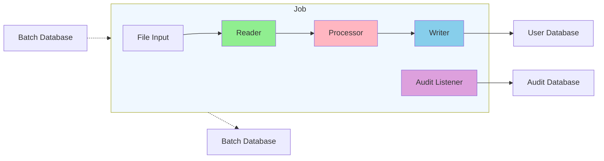

# Spring Boot Batch Upgrade Demo

This project demonstrates the upgrade process from Spring Boot 2 to Spring Boot 3, along with the corresponding Spring
Batch upgrade from version 4 to 5.

## How To Use This Repo

There are several variants represented in this repo. Each use case has a Spring Boot 2 branch and then a corresponding `-upgrade`
branch that demos the upgrade process to Spring Boot 3.

The easiest way to quickly see the upgrade process is to check the diffs between the non-upgraded branch and the 
upgraded branch. You can do this quickly by selecting and viewing the branch in the GitHub UI and clicking on text at
the top that says "This branch is N commits ahead of main." and looking at the single upgrade commit. 

Alternatively, you can clone the repo and run something along the lines `git diff main upgrade` to see the diff.

## Project Variants

### Simple Variant

* [main branch](https://github.com/JamesMcMahon/spring-boot-demo-batchupgrade/tree/main)
* [upgrade branch](https://github.com/JamesMcMahon/spring-boot-demo-batchupgrade/tree/upgrade)

This simple variant demonstrates a Spring Batch job that processes data in the following flow:

1. Reader - Reads simple "user" input data from a csv file
2. Processor - Transforms the user data by uppercasing both first and last names
3. Writer - Writes transformed data into an H2 database

### Databaseless (Resourceless) Variant

* [databaseless branch](https://github.com/JamesMcMahon/spring-boot-demo-batchupgrade/tree/databaseless)
* [databaseless-upgrade branch](https://github.com/JamesMcMahon/spring-boot-demo-batchupgrade/tree/databaseless-upgrade)

This variant writes to a file output instead of a database to show the process to get Spring Batch
to work without a database connection.

Due to some design issues with Spring Batch 5, this variant may be more complex than you might initially think. 
Simply put, Batch makes the assumption that you always want to write job metadata to a database. 
This is a design choice that will be addressed in Spring Batch 6.

In the upgrade branch I've centralized everything needed to operate without a Batch database inside the 
`resourcelessbatch` package. You should be able to drop this package in a Batch project and have an easier time
not using a database.

*Note: The `ResourcelessJobRepository` used by this approach is not thread safe. In general, only take the approach in this variant if you do not need scaling or resilience in your Batch jobs.*

Relevant discussions:

- https://github.com/spring-projects/spring-batch/issues/4718
- https://stackoverflow.com/a/79492398

### Multiple Database Variant

* [multiple-databases branch](https://github.com/JamesMcMahon/spring-boot-demo-batchupgrade/tree/multiple-databases)
* [multiple-databases-upgrade branch](https://github.com/JamesMcMahon/spring-boot-demo-batchupgrade/tree/multiple-databases-upgrade)

There is a more complex version that includes multiple H2 databases
The databases are used for the following:

* Batch Database - stores Spring Batch metadata and manages job execution.
* User Database – stores the processed User data from the writer.
* Audit Database – stores details about the Batch job that could be used for auditing purposes.

*Note: This audit database just for example purposes as Spring Batch already saves this data, so saving it again is
redundant.*

## Useful Resources

* [Spring Batch 5.0 Migration Guide](https://github.com/spring-projects/spring-batch/wiki/Spring-Batch-5.0-Migration-Guide)
* [Spring Boot 3.0 Migration Guide - Batch Changes](https://github.com/spring-projects/spring-boot/wiki/Spring-Boot-3.0-Migration-Guide#spring-batch-changes)
