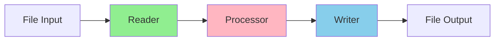
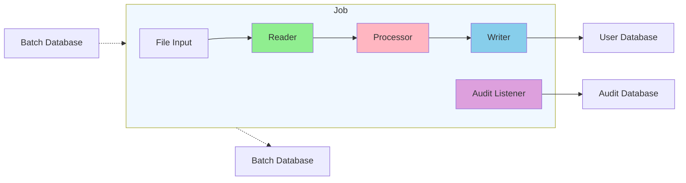

# Spring Boot Batch Upgrade Demo

This project demonstrates the upgrade process from Spring Boot 2 to Spring Boot 3, along with the corresponding Spring
Batch upgrade from version 4 to 5.

## Project Structure

This project demonstrates a Spring Batch job that processes data in the following flow:

1. Reader - Reads simple "user" input data from a csv file
2. Processor - Transforms the user data by uppercasing both first and last names
3. Writer - Writes transformed data into a database

### Databaseless Variant

There is also a variant that writes to a file output instead of a database to show the process to get Spring Batch
to work without a database connection.

*In general, I don't recommend this approach. If you don't want to use a database (or don't have access to one),
I recommend replacing the external database dependency with an in-memory H2 database, as seen in the first example.
This keeps things simpler from a bean-overriding perspective.*

### Multiple Database Variant

There is a more complex version that includes multiple H2 databases
The databases are used for the following:

* Batch Database - stores Spring Batch metadata and manages job execution.
* User Database – stores the processed User data from the writer.
* Audit Database – stores details about the Batch job that could be used for auditing purposes.

*Note: This audit database just for example purposes as Spring Batch already saves this data, so saving it again is
redundant.*

## Branches

Each branch represents a specific configuration to help you understand the upgrade process and implementation options.

* `main` - Spring Boot 2.x with Spring Batch 4.x (Pre-upgrade version with a single H2 database)
* `upgrade` - Spring Boot 3.x with Spring Batch 5.x (Post-upgrade version with a single H2 database)
* `databaseless` - Spring Boot 2.x without database dependency (File-based output)
* `databaseless-upgrade` - Spring Boot 3.x without database dependency (File-based output)
* `multiple-databases` - Spring Boot 2.x with multiple H2 databases
* `multiple-databases-upgrade` - Spring Boot 3.x with multiple H2 databases

## Useful Resources

* [Spring Batch 5.0 Migration Guide](https://github.com/spring-projects/spring-batch/wiki/Spring-Batch-5.0-Migration-Guide)
* [Spring Boot 3.0 Migration Guide - Batch Changes](https://github.com/spring-projects/spring-boot/wiki/Spring-Boot-3.0-Migration-Guide#spring-batch-changes)
